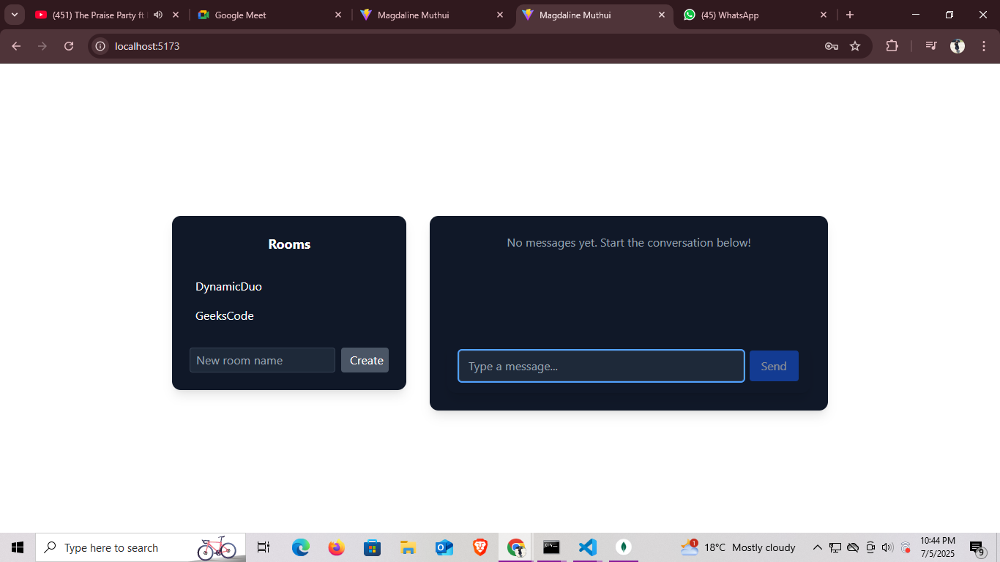
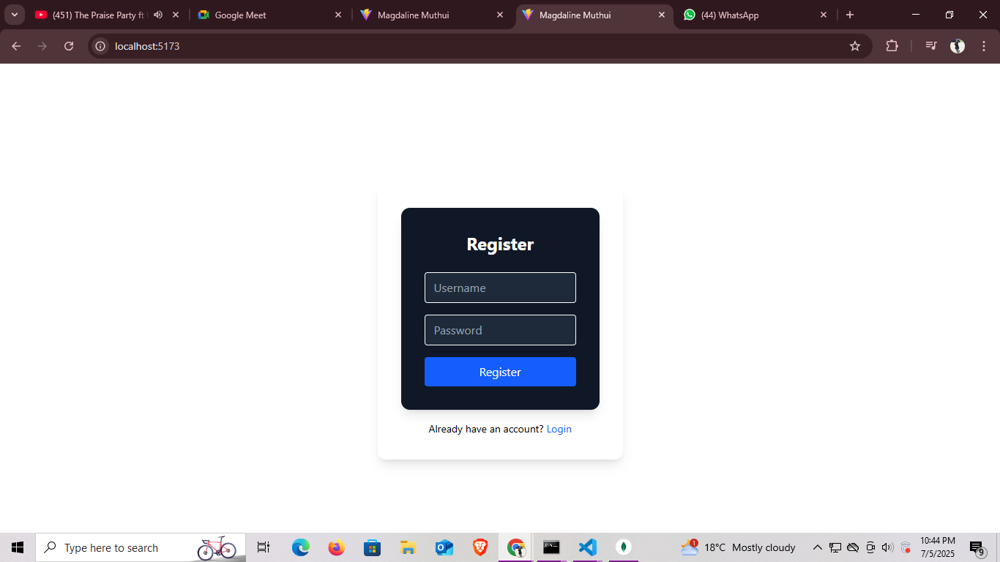
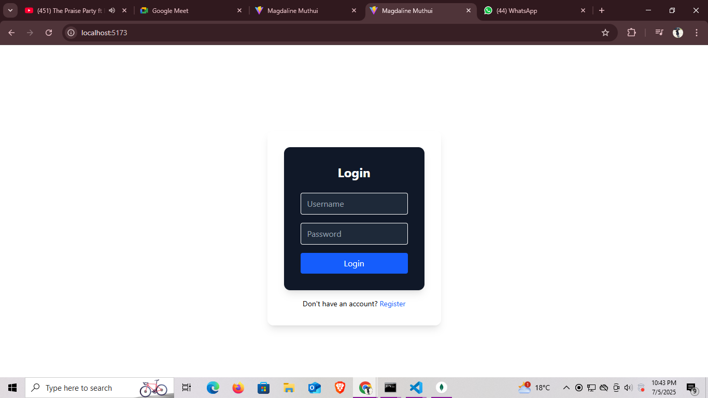

# 💬 Real-Time Chat App (Socket.io, React, Node.js, MongoDB)

## 🚀 Project Overview
This is a full-stack real-time chat application built with React, Node.js, Express, Socket.io, and MongoDB. It supports multiple chat rooms, real-time messaging, authentication, notifications, reactions, unread message counts, and more. The app is styled with Tailwind CSS for a modern, responsive UI.

**Key Technologies:**
- Frontend: React, Vite, Tailwind CSS, Socket.io-client
- Backend: Node.js, Express, Socket.io, MongoDB (Mongoose), JWT

---

## 🛠️ Setup Instructions

### Prerequisites
- Node.js v18 or higher
- MongoDB (local or Atlas)

### 1. Clone the repository
```
git clone https://github.com/PLP-MERN-Stack-Development/week-5-web-sockets-assignment-Protas-Junior.git
cd week-5-web-sockets-assignment-Protas-Junior
```

### 2. Configure Environment Variables
- Copy `.env.example` to `.env` in both `client/` and `server/` folders and fill in the required values (e.g., MongoDB URI, JWT secret).

### 3. Install Dependencies
```
cd server
npm install
cd ../client
npm install
```

### 4. Start the Development Servers
- In one terminal:
```
cd server
npm run dev
```
- In another terminal:
```
cd client
npm run dev
```

### 5. Open the App
- Visit [http://localhost:5173](http://localhost:5173) in your browser.

---

## ✨ Features Implemented
- User authentication (JWT, register/login)
- Create, join, and switch between multiple chat rooms
- Real-time messaging with Socket.io
- Message persistence (MongoDB)
- Typing indicators
- Read receipts
- Message reactions (like, love, etc.)
- Unread message count per room
- System messages for join/leave events
- Browser and sound notifications for new messages
- Responsive, modern UI (Tailwind CSS)
- Error handling and loading states
- (Optional) File/image sharing, message search, delivery acknowledgment

---

## 📸 Screenshots







---

## 👤 Author
Miss Protas Junior
